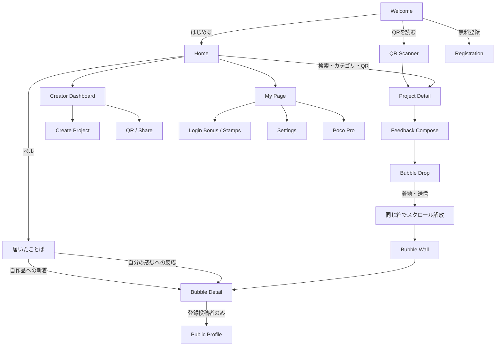
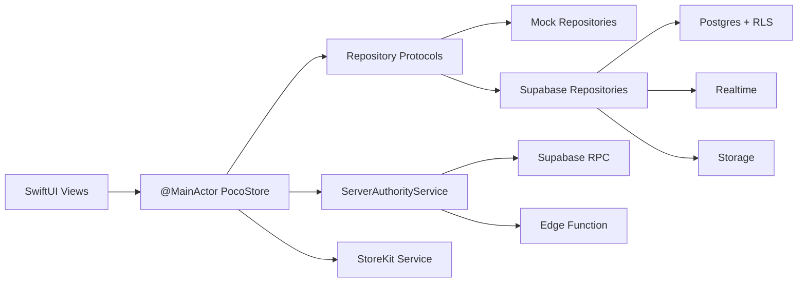

# Poco 基本設計・現行イベント／機能一覧

更新日: 2026-07-29
対象: iOS 17+ / Swift 6 / SwiftUI / Supabase基盤
目的: 現在の実装をプロダクト・UX・権限・データの観点から精査できる状態にする。

## 0. ステータスの読み方

- **実装済み**: iOSコードと、必要な場合はRepository／Migrationまで存在する。
- **基盤のみ**: Model、Capability、UI境界などはあるが、本番機能は完成していない。
- **Mock／仮表示**: 画面確認用。実データ連携や配信は未実装。
- **未実装**: 仕様候補として会話に登場したが、現在のアプリでは利用できない。

---

# Part 1: Pocoの基本設計

## 1. プロダクト定義

Pocoは、作品についての感想を「フキダシ」として届け、たくさんのことばが物理的に積み重なる体験を提供するアプリである。

中心価値は次の一文とする。

> あなたのことばが、クリエイターのチカラになる。

Pocoは会話を継続するSNSではなく、作品にことばを届け、作者やほかの人から小さな反応を受け取る場所とする。

### 1.1 変更してはいけない体験

1. 作品を見つける。
2. 感想を書く。
3. フキダシを左右に動かして落とす。
4. 既存のフキダシへ衝突し、ぷよんと着地する。
5. 同じ画面のまま縦スクロールが解放される。
6. 過去から最新まで、積み重なったことばを見る。

投稿ボタンを押した時点では送信完了にせず、**着地が投稿確定の体験上の節目**になる。

### 1.2 意図的に作らないもの

- コメントへの返信、スレッド、引用返信
- リポスト、引用投稿
- 公開会話タイムライン
- オンライン状態、入力中表示
- フォロー数や反応数だけを競わせるランキング中心の設計

感想の次に許可するコミュニケーションは、原則として「いいね」と将来のポジティブなスタンプだけに限定する。

### 1.3 タイポグラフィ

- ブランドフォントはZen Maru Gothic（SIL Open Font License 1.1）とする。
- Regular／Medium／Boldの3ウェイトに絞り、過度なウェイト混在を避ける。
- SwiftUI本文・見出し・入力欄・フキダシ内のSpriteKit文字を同じファミリーで統一する。
- `PocoTypography`でDynamic Typeに追従し、フォント読込失敗時はiOSシステムフォントへフォールバックする。
- SF Symbols、QR内の技術文字列など、機能上システムフォントが適切な箇所は例外とする。

### 1.4 UIコピー

- 見れば分かる内容を、見出し直下の説明文やボタン下の注釈で言い直さない。
- ボタン名、アイコン、選択状態、件数表示で伝わる内容はUIそのものに任せる。
- 同じ方針を新規画面と既存画面の双方へ横断適用する。
- 説明を残すのは、入力制約、失敗理由、権限制限、投稿期限、課金・削除など不可逆な操作、法務・安全上の注意に限る。
- VoiceOver向けの`accessibilityLabel`と`accessibilityHint`は視覚上の説明文とは分離し、必要な操作情報を維持する。

## 2. ユーザー区分

| 区分 | 認証状態 | 主目的 | 広告 | 作品上限 |
|---|---|---|---|---:|
| ゲスト | Supabase Anonymous Auth。登録UIなし | 「名無し」で24時間だけ感想を届ける | あり | 0 |
| Pocoユーザー | Sign in with Appleで登録済み | 公開プロフィール、作品作成、活動記録 | あり | 基本3、確定効果の⭐︎拡張で最大5 |
| Poco Pro | サーバーで有効な課金資格を確認済み | 詳細記録、キャラ進化、広告なし等 | なし | 30 |

端末のStoreKit検証成功だけではPoco Proにしない。署名済みTransactionをサーバーへ送り、`memberships`が`active`または`trialing`であることを再取得できた場合だけPro権限を付与する。

### 2.1 登録時に取得する情報

- 必須は公開ニックネームだけとする。
- アバターは内蔵5種からデフォルトを選択済みにし、写真への変更は任意とする。
- `@handle`はUUIDから自動発行し、登録後のプロフィール編集でのみ任意変更する。
- メールアドレスとApple氏名はフォームで再入力させない。初回Sign in with AppleレスポンスだけをAuthの非公開情報へ保存し、公開`profiles`には含めない。
- 性別、電話番号、正確な生年月日は取得しない。

## 3. コミュニケーション設計

```text
作品
 └─ 感想（フキダシ）
     ├─ 通常いいね（1ユーザーにつき1回）
     ├─ 作者が押した通常いいね
     │   └─ いいね数 +1、同じフキダシに作者❤️を表示
     └─ 通報／投稿者削除／作者非表示
```

- 作者専用の別ボタンは設けない。
- 作者が同じ「いいね」を押した場合、通常のいいね数にも含める。
- 作者❤️は制作者本人ページでのみ付く「作者に届いた」という付加情報であり、別のリアクション数ではない。許可あり・ファン作成ページの所有者によるいいねは通常の共感として扱う。
- 匿名フキダシには公開プロフィール導線を付けない。
- 登録ユーザーのフキダシは、作者名・アバター部分または詳細からプロフィールを開ける。

## 4. 主要画面と遷移



### 4.1 Deep Link

- 対応URL: `poco://project/{projectID}`、`https://{domain}/project/{projectID}`、`https://{domain}/p/{projectID}`
- 入口: iOS `onOpenURL`、QR Scanner、URL手入力
- 動作: Welcome未完了でもWelcomeを完了し、対象Project Detailを開く。
- Universal Links公開後は、インストール済み端末で`https://{domain}/project/{projectID}`から対象Project Detailを直接開く。
- 未インストール時は同じHTTPS URLのWebランディングでApp Storeへ案内する。App Store経由後にインストール前URLが自動復元されることは前提にしない。
- 初回起動のWelcomeには「QRコードを読み取る」「検索する」「@クリエイターIDから探す」を置き、同じQRを再読込して登録前のゲストでも感想投稿へ進める。
- アプリ内解析、Associated Domains、AASAは実装済み。公開完了には所有HTTPSドメインとWebランディングが必要である。

### 4.2 通知・「届いたことば」

ベルから開く画面は一般的なお知らせ一覧ではなく、クリエイターと投稿者へ反応が直接届く受信箱とする。運営ニュースとアップデートはHomeのメガホンから別の読取専用一覧を開く。

優先順位は次のとおり。

1. **届いたことば**: 自分の作品へ新しい感想が投稿された。
2. **作者からの❤️**: 自分の感想を作品作者がいいねした。
3. **共感**: 自分の感想へ通常いいねが付いた。
4. **システム通知**: Moderation結果、課金・重要なアカウント情報。

新着感想の行には作品名、ニックネーム、短い本文抜粋、受信日時、未読状態を表示する。タップすると作品トップではなく、対象フキダシの詳細へ直接移動する。登録投稿者のプロフィール導線は詳細内に置き、匿名投稿者は反応しない。

アプリ内ではRealtimeで受信箱を更新し、バックグラウンド時はAPNsを補助として使う。Push payloadへ感想全文を含めず、通知ID・種別・対象IDをもとに認証後のRepositoryから詳細を取得する。通知レコードはサーバーだけが作成し、RLSにより受信者本人だけが取得・既読更新できるようにする。

## 5. アーキテクチャ



### 5.1 レイヤー責務

| レイヤー | 責務 |
|---|---|
| Views | 表示、ユーザー操作、SwiftUI Navigation／Sheet、アクセシビリティ |
| `PocoStore` | 画面状態、ユースケース調整、Optimistic UI、Taskライフサイクル |
| Domain Models | `Project`、`Feedback`など。Supabase SDKへ依存しない |
| DTO | DBカラムとのCodable変換 |
| Repository Protocol | データ取得・保存の境界。ViewからSupabaseを呼ばせない |
| Supabase Repository | PostgREST、Realtime、Storageの具体実装 |
| Server Authority | 課金資格同期とスターコイン検証。端末を最終決定者にしない |
| Mock Repository | Preview、開発、オフラインUI確認 |

### 5.2 MainActor／Concurrency

- UI状態を持つ`PocoStore`は`@MainActor`。
- Repository APIは`async throws`か`AsyncThrowingStream`。
- Realtime購読Taskは作品ID単位で保持し、画面終了時にキャンセルする。
- 画像圧縮は`Task.detached`でMainActor外へ逃がす。
- ViewはSupabase SDKを直接参照しない。

## 6. データの正と整合性

| データ | 正とする場所 | 主な保証 |
|---|---|---|
| Project | Supabase `projects` | 作成者、公開状態、作品数上限をDBで検証 |
| Feedback | `feedbacks` + `feedback_ownership` | 投稿者所有権を非公開テーブルへ分離 |
| いいね | `feedback_likes` | `(feedback_id, user_id)` UNIQUEで二重いいね防止 |
| 作者❤️ | `feedback_creator_receipts` | 作者の通常いいねをDB Triggerで反映 |
| Pro資格 | `memberships` | アプリから更新不可。サーバー検証後のみ更新 |
| スターコイン | `member_reward_progress` + `star_coin_transactions` | RPCだけが付与。イベント・金額・重複・上限をDBで検証 |
| 達成スタンプ | `member_achievement_stamps` | 所有権や件数をDBで再計算 |
| 通知 | `notifications` | DB Triggerだけが生成、イベントキーで冪等化、本人だけread／個別既読 |
| 画像 | Supabase Storage | DBへbase64を保存しない |

### 6.1 制限値

| 対象 | 現在値 | 最終保証 |
|---|---:|---|
| 感想本文 | 500文字 | iOS + DB RPC |
| 1ユーザー／1作品の感想 | 3件 | DB Trigger + Advisory Lock |
| Pocoユーザーの作品 | 基本3作品、200⭐︎で4作品、追加400⭐︎で最大5作品 | DB RPC + Advisory Lock + 冪等Redeem |
| Poco Proの作品 | 30作品 | DB RPC + Advisory Lock |
| 通常キャラ出現 | 感想ごとに決定的15% | iOS表示 + Coin RPC再検証 |
| 同種キャラ合体後のレア誕生 | 決定的5% | iOS表示 + Coin RPC再検証 |
| キャラ系コイン | 1日30⭐︎ | DB RPC |
| 感想送信報酬 | 1日20投稿分 | DB RPC |

登録ユーザーの削除済み感想は3件制限の有効件数から外れ、言い直しのための枠が戻る。ゲストは自己削除後も同一Auth Identity・同一作品の生涯3件に算入し、投稿→削除→再投稿による通知スパムを防ぐ。

## 7. フキダシとキャラの物理設計

### 7.1 フキダシ

- SpriteKitで衝突・落下を表現する。
- 文字数によりSmall／Medium／Largeの3段階。
- 必ず3列へ固定せず、決定的な乱数で横位置・高さ・回転を変える。
- 最新を画面上部に置き、古い感想へ下方向にスクロールする。
- Drop前は十分な落下距離を確保し、Drop後だけ同じ箱の縦スクロールを解放する。
- Reduce Motion時は動きを抑え、操作・情報は失わない。

### 7.2 顔ぷよ

- フキダシとは別オブジェクト。
- 共通キャラクター「Poco」は感想IDから決定する15%で出現する。
- 画面を占有しすぎないよう、見た目より小さい円形Physics Bodyを使う。
- フキダシの近くへ少し重ねて配置し、余白を広げすぎない。
- フキダシ、通常キャラ、レアキャラへ接触しても大きく横へ弾かず、その場で約0.15秒の「縮む→膨らむ→静止」により視覚的に「ぷよん」と変形する。
- キャラ同士は余白を押し広げず、見た目が重なれる小さいPhysics Bodyを維持する。
- タップでも「ぷよん」と反応する。
- ProではPoco同士が接触すると2体を消費する。
- 合体時は95%で消滅、5%でレアキャラが誕生する。
- Reduce Motion有効時は拡縮・反動を省略し、接触、合体、誕生という結果だけを即時反映する。既存の`SET-004`判定を共用し、新しい設定項目は増やさない。

## 8. セキュリティ原則

- Supabase URL／Anon Keyはxcconfig経由。Swiftへ直書きしない。
- Service Role Key、App Store秘密情報はiOSアプリへ含めない。
- RLSをすべてのユーザーデータテーブルで有効化する。
- 匿名利用にもSupabase Anonymous Auth IDを与え、いいね・投稿上限・通報をDBで識別する。
- Clientが送ったコイン金額、Proフラグ、集計値を信用しない。
- 通報、投稿者削除、作品作者による非表示、ユーザーブロックを分離する。
- 作者非表示は復旧・監査可能なソフト削除とする。
- 作品削除も即時非公開＋30日保持とし、クライアント物理削除を許可しない。未解決の通報／権利者申請はパージを保留し、通報時の原文Snapshotは不変証拠として保持する。
- 投稿、Like、通報はTransaction Advisory Lock付きレート制限とDB制約を最終判定にし、UIの連打防止だけを信用しない。
- ブロックは表示フィルタだけでなく、Feedback取得、新規投稿、LikeのDB判定にも適用する。
- 公開プロフィールは登録ユーザーに限定し、匿名Auth UUIDを会員一覧として列挙させない。
- Releaseの本番設定不備時はfail-closedし、Mockで未送信を送信済みに見せない。
- 大量Botと改造アプリはRLSだけで防げないため、公開前にCAPTCHA、App Attest付きEdge Function、監視とBackupを`SecurityOperations.md`に従って有効化する。

---

# Part 2: 現在のイベント一覧

## 9. アプリ・導線イベント

| ID | イベント | トリガー | 現在の処理 | 状態 |
|---|---|---|---|---|
| APP-001 | App Launch | アプリ起動 | Store生成、アカウント・会員・作品・Moderation読込 | 実装済み |
| APP-002 | Welcome Complete | 「はじめる」 | `hasCompletedWelcome`保存、Main Tab表示 | 実装済み |
| APP-003 | Deep / Universal Link Open | `poco://`または許可HTTPS URL | UUID検証、公開作品の単体RPC取得後、Home Navigation Pathへ追加 | 実装済み |
| APP-004 | QR Scan | QR読取 | Poco URLをDeep Link処理へ渡す | 実装済み |
| APP-005 | Manual URL Open | ScannerのURL入力 | Poco URL検証後に作品を開く | 実装済み |
| APP-006 | Project Search | 検索文字変更 | 作品名、作者名、`@handle`、説明、カテゴリを端末内絞込 | 実装済み |
| APP-007 | Category Filter | カテゴリ選択 | 全て／本／ゲーム／マンガ／その他を絞込 | 実装済み |

## 10. アカウント・プロフィールイベント

| ID | イベント | トリガー | 現在の処理 | 状態 |
|---|---|---|---|---|
| AUTH-001 | Anonymous Session Ensure | ゲストでRepository利用 | Supabase Anonymous Authユーザーを確保 | 実装済み |
| AUTH-002 | Apple Registration | Sign in with Apple | nonce検証、匿名Identityを可能ならlink、Profile保存 | 実装済み |
| AUTH-002A | Minimal Registration | 登録画面 | 必須ニックネーム＋任意アバターのみ。`@handle`は自動発行 | 実装済み |
| AUTH-002B | First Apple Identity Capture | 初回Apple認証 | 初回だけ返るメール・氏名を非公開Auth metadataへ退避 | 実装済み |
| AUTH-003 | Avatar Select | 登録／編集 | 内蔵5種から選択 | 実装済み |
| AUTH-004 | Custom Avatar Select | PhotosPicker | 512px・JPEG圧縮、Storage upload | 実装済み |
| AUTH-005 | Profile Update | 保存 | 名前、`@handle`、画像を更新 | 実装済み |
| AUTH-006 | Public Profile Open | フキダシ作者をタップ | 登録投稿者だけプロフィールへ遷移 | 実装済み |
| AUTH-007 | Anonymous Author Tap | 匿名フキダシ作者部分をタップ | `senderID`がないため何もしない | 実装済み |
| AUTH-008 | Sign Out | 設定からログアウト | セッションと端末内ユーザー状態・コインキャッシュをクリア | 実装済み |
| AUTH-009 | Delete Account | 設定で「削除」と入力後に再確認 | 本人JWT再検証、公開データ匿名化、Storage削除、Auth soft delete | 実装済み（本番適用待ち） |

## 11. 作品イベント

| ID | イベント | トリガー | 現在の処理 | 状態 |
|---|---|---|---|---|
| PRJ-001 | Project List Load | Home表示 | Repositoryから公開作品を取得 | 実装済み |
| PRJ-002 | Create Gate | Create Tab | ゲストは登録Sheet、登録済みはDashboard | 実装済み |
| PRJ-003 | Create Project | 作品保存 | 所有関係、同意、画像を含めDB RPCで作成 | 実装済み |
| PRJ-004 | Publishing Rules Consent | Create画面 | 制作者本人／許諾済み／ファン箱を選択し同意 | 実装済み |
| PRJ-005 | Project Limit Reached | 4件目または31件目 | 専用Sheet。無料会員はPro導線を表示 | 実装済み |
| PRJ-006 | Project Image Upload | PhotosPicker後に保存 | 1600px以内、JPEG約0.8、Storageへ保存 | 実装済み |
| PRJ-007 | Generate QR | QR画面表示 | CoreImage `CIQRCodeGenerator` | 実装済み |
| PRJ-008 | Save QR | 保存ボタン | 写真ライブラリへ保存 | 実装済み |
| PRJ-009 | Copy Link | コピーボタン | Deep LinkをPasteboardへコピー | 実装済み |
| PRJ-010 | Share Project | ShareLink | iOS共有Sheetを表示 | 実装済み |
| PRJ-011 | Edit Project | Dashboardの管理メニュー | 作成フォームを再利用。URL／QRを維持して本文・区分・画像を更新 | 実装済み |
| PRJ-011B | Delete Project | Dashboardの管理メニュー | 即時非公開にして30日後のパージ対象へ移し、監査・通報中は証拠を保持 | 実装済み |
| PRJ-012 | Content Rating Select | 作品登録 | `general`／`mature`を自己申告。露骨な性的表現は禁止 | 実装済み |
| PRJ-013 | Safe Project Browse | 一覧・検索 | DB RPCが成人向け画像・本文をサーバー側で除去しロック表示 | 実装済み |
| PRJ-014 | On-device Image Check | 画像選択 | iOS 17 Sensitive Content Analysisが利用可能な端末だけ一次判定 | 実装済み |

## 12. 感想・フキダシイベント

| ID | イベント | トリガー | 現在の処理 | 状態 |
|---|---|---|---|---|
| FB-001 | Start Compose | 「感想を送る」 | 自分の有効感想が3件未満ならCompose表示 | 実装済み |
| FB-002 | Draft Update | 本文入力 | 500文字へ制限、文字数表示 | 実装済み |
| FB-003 | Create Local Bubble | 「フキダシをおとす」 | Feedbackを端末内で作りDrop画面へ移動 | 実装済み |
| FB-004 | Drag Pending Bubble | Drop前の左右ドラッグ | 落下開始位置だけを左右調整 | 実装済み |
| FB-005 | Release Bubble | スワイプ／操作終了 | 重力を有効化して十分な距離を落下 | 実装済み |
| FB-006 | Bubble Contact | フキダシ同士が接触 | バウンド、ぷよん変形 | 実装済み |
| FB-007 | Bubble Landed | 床または既存フキダシへ着地 | Haptic、スクロール解放、送信開始 | 実装済み |
| FB-008 | Optimistic Submit | 着地後 | フキダシを残したままRepositoryへ送信 | 実装済み |
| FB-009 | Submit Success | Supabase成功 | Optimistic ID解除、3⭐︎ claim | 実装済み |
| FB-010 | Submit Failure | 通信失敗 | フキダシを消さずRetry UIを表示 | 実装済み |
| FB-011 | Feedback Realtime Insert | 他端末が投稿 | Bubble Wallへ新規Feedbackを追加 | 実装済み |
| FB-012 | Open Bubble Detail | フキダシをタップ | 本文、作者、日時、いいね、Moderation操作 | 実装済み |
| FB-013 | Scroll History | Drop後／WallでPan | 最新から古い感想まで同じ物理空間を移動 | 実装済み |
| FB-014 | Focus Own/New Bubble | 「自分のことば」「新着」 | 対象Feedback位置までカメラ移動 | 実装済み |

## 13. リアクション・Moderationイベント

| ID | イベント | トリガー | 現在の処理 | 状態 |
|---|---|---|---|---|
| REACT-001 | Like Feedback | いいねボタン | Optimistic +1、DB UNIQUEで1人1回を保証 | 実装済み |
| REACT-002 | Duplicate Like | いいね済みを再実行 | UI無効化 + DB UNIQUE。増加しない | 実装済み |
| REACT-003 | Creator Like | 作品作者が同じLikeを押す | 通常Like +1、Triggerで作者❤️Receipt生成 | 実装済み |
| REACT-004 | Creator Receipt Realtime | 作者❤️生成 | 開いているフキダシへ❤️を反映 | 実装済み |
| MOD-001 | Report Feedback | 全ユーザーの通報送信 | 理由・詳細をDBへ保存。1人1投稿1通報 | 実装済み |
| MOD-002 | Delete Own Feedback | 投稿者が削除 | `deleted_by_author`で画面から除外。登録会員だけ投稿枠を戻し、ゲストは生涯3件上限に算入し続ける | 実装済み |
| MOD-003 | Hide as Creator | 作品作者が非表示 | ソフト非表示。運営監査・復旧用記録を保持 | 実装済み |
| MOD-004 | Block Profile | 公開プロフィールからブロック | 対象ユーザーのフキダシをローカル表示から除外 | 実装済み |
| MOD-005 | Admin Moderation Review | 運営が通報処理 | 管理画面なし | 未実装 |
| MOD-006 | Rights Holder Request | 権利者が作品箱の削除を申請 | 作品Snapshot、立場、非公開連絡先、理由を保存。進行中重複と日次上限をDBで保証 | 実装済み |

## 13.1 Q&Aイベント

| ID | イベント | トリガー | 現在の処理 | 状態 |
|---|---|---|---|---|
| QA-001 | Open Q&A | Home／マイページのQ&A | 届いた質問／送った質問を表示 | 実装済み |
| QA-002 | Send Question | Q&A受付中の作品詳細 | 登録ユーザーだけが感想箱所有者へ質問。非公式ページでは著作者宛てと誤認させない | 実装済み |
| QA-003 | Question Rate Guard | 質問送信 | 同一送信者／作者で24時間3件、未回答3件をDB Lock付きRPCで強制 | 実装済み |
| QA-004 | Answer Once | 作者が回答 | 未回答かつ30日以内の質問へ1回だけ回答 | 実装済み |
| QA-005 | Withdraw Question | 送信者が取り下げ | 保留枠を解放。24時間の累計には残す | 実装済み |
| QA-006 | Expire Question | 未回答で30日経過 | `expired`へ移行し保留枠を解放 | 実装済み |
| QA-007 | Report Question | 当事者が通報 | 不変Snapshotを非公開Evidenceへ保存 | 実装済み |
| QA-008 | Block Participant | 質問詳細からブロック | 既存User Blockを使い、以後の質問作成RPCも拒否 | 実装済み |
| QA-009 | Project Q&A Opt-in | 作品作成・編集 | 感想箱所有者が受付ON／OFFを選択し、DB Triggerも新規質問を拒否 | 実装済み |

## 14. 顔ぷよ・スターコインイベント

| ID | イベント | 条件 | 報酬／処理 | 状態 |
|---|---|---|---|---|
| CHAR-001 | Normal Companion Appear | Feedback IDの決定値が15%範囲 | フキダシ横へ独立キャラを配置 | 実装済み |
| CHAR-002 | Companion Contact | キャラがフキダシ／キャラへ接触 | 小さいBodyで密集を許容。横へ弾かず0.15秒で縮む→膨らむ→静止 | 実装済み |
| CHAR-003 | Companion Tap | 通常キャラ初回タップ | ぷよん + 1⭐︎ claim | 実装済み |
| CHAR-004 | Same Avatar Merge | Pro、同じ種類の通常キャラ2体が接触 | 2体を消費 | 実装済み |
| CHAR-005 | Merge Disappear | Merge Keyの95% | 2体とも消えて終了 | 実装済み |
| CHAR-006 | Rare Companion Birth | Merge Keyの5% | レアキャラ誕生 + 5⭐︎ claim | 実装済み |
| CHAR-007 | Rare Companion Tap | 誕生済みレアキャラ初回タップ | ぷよん + 1⭐︎ claim | 実装済み |
| COIN-001 | Feedback Delivered Reward | 自分の投稿所有権をDB確認 | 3⭐︎ | 実装済み |
| COIN-002 | Coin Duplicate Claim | 同じUser/Event Key | 0⭐︎、残高のみ返却 | 実装済み |
| COIN-003 | Coin Daily Cap | キャラ30⭐︎／感想20件分 | 超過分は付与しない | 実装済み |

通常キャラ出現は現在すべての役割に見える。**Pro限定なのは同種合体とレア誕生**である。

## 15. 会員・ごほうび・設定イベント

| ID | イベント | トリガー | 現在の処理 | 状態 |
|---|---|---|---|---|
| PRO-001 | Load Offer | Pro画面表示 | StoreKit Productと価格を取得 | 実装済み |
| PRO-002 | Purchase | 購入ボタン | StoreKit検証後、Edge Function同期 | 基盤のみ |
| PRO-003 | Restore | 購入復元 | 現在Entitlementを探し、同じ同期へ送る | 基盤のみ |
| PRO-004 | Entitlement Confirmed | DB Membership再取得 | active/trialingの場合だけPro化 | 実装済み |
| REWARD-001 | Daily Bonus Claim | 登録ユーザーが1日1回 | `[3,3,5,3,5,7,15]`⭐︎の7日サイクル | 実装済み |
| REWARD-002 | Achievement Refresh | ごほうび画面表示 | DB条件から6種スタンプを解放 | 実装済み |
| SET-001 | Reaction Notification Toggle | 設定変更 | UserDefaults保存 | UIのみ |
| SET-002 | Creator Heart Toggle | 設定変更 | UserDefaults保存 | UIのみ |
| SET-003 | System Reduce Motion | iOS設定 | ぷよん／物理演出を抑え、操作と情報は維持 | 実装済み |
| NOTIFY-001 | Notification Inbox | ベルを開く | 「届いたことば」、リアクション、Pocoからの順で本人の通知を表示 | 実装済み |
| NOTIFY-002 | New Feedback Received | 自作品へ新しい感想が着地・送信成功 | 作品名、投稿者、抜粋を受信箱へ追加し、タップで該当フキダシ詳細へ遷移 | 実装済み |
| NOTIFY-003 | Feedback Liked | 自分の感想へ通常いいね | 共感通知を追加し、タップで該当フキダシ詳細へ遷移 | 実装済み |
| NOTIFY-004 | Creator Heart Received | 作品作者が自分の感想へいいね | 作者❤️通知を通常共感より強く表示 | 実装済み |
| NOTIFY-005 | Inbox Realtime Update | アプリ表示中に通知生成 | Repository購読により未読件数と一覧へ即時反映 | 実装済み |
| NOTIFY-006 | Push Notification | バックグラウンドで対象イベント発生 | APNsは本文全文を持たず、通知IDから認証後に詳細取得 | 未実装 |
| NOTIFY-007 | Notification Read | 通知または対象詳細を開く | 受信者本人だけ個別既読更新、ベルの未読Badgeを再集計 | 実装済み |

---

# Part 3: 現在の機能一覧

## 16. 権限マトリクス

| 機能 | ゲスト | Pocoユーザー | Poco Pro |
|---|:---:|:---:|:---:|
| 公開作品閲覧・検索・カテゴリ | ○ | ○ | ○ |
| QR／URLから作品を開く | ○ | ○ | ○ |
| 感想投稿（1作品3件） | ○（名無し・24時間） | ○ | ○ |
| 通常いいね（1フキダシ1回） | ○ | ○ | ○ |
| 通報 | ○ | ○ | ○ |
| 登録投稿者のプロフィール閲覧 | ○ | ○ | ○ |
| 自分の公開プロフィール | − | ○ | ○ |
| 内蔵／写真プロフィール画像 | − | ○ | ○ |
| 作品作成 | × | 基本3件／⭐︎拡張で最大5件 | 30件 |
| QR保存・Link共有 | − | ○ | ○ |
| 送った／いいねした感想履歴 | 公開期限内のみ | ○ | ○ |
| ログインボーナス・達成スタンプ | × | 当日初回Home／マイページ | 当日初回Home／マイページ |
| みんなのフキダシ | ○ | ○ | ○ |
| 作品の記録・簡易統計 | × | × | ○ |
| 自作品／自感想が得たLike集計 | × | ○ | ○ |
| 共感順・作品ごとの詳細分析 | × | × | ○ |
| 通常キャラ表示・タップ | ○ | ○ | ○ |
| 同種キャラ合体・レア誕生 | × | × | ○ |
| コード付き非公開作品 | × | × | 基盤のみ |
| 背景・作品バッジカスタマイズ | × | ○ | ○ |
| 広告 | 表示枠あり | 表示枠あり | 非表示 |

## 17. 実装済み機能

- Welcome、Home、Project Detail、Compose、Drop、WallのMVP導線
- Home検索、カテゴリFilter、QR Scanner、Deep Link
- 文字数3段階のフキダシ、SpriteKit物理、縦スクロール、Haptic
- 15%顔ぷよ、接触／タップのぷよん、Pro合体、5%レア誕生
- Sign in with Apple、匿名Identity link、プロフィール、内蔵／写真アバター
- 必須ニックネームだけの最小登録、`@handle`自動発行、Apple初回情報の非公開保存
- Project作成、所有関係分類、登録同意、画像圧縮／Storage
- Project編集／削除、画像差し替え／削除、破壊的操作の確認UI
- 作品の公式／販売ページURL、プロフィールのX／Instagram／YouTube／TikTok／Webリンク
- 作品の一般／成人向け区分、サーバー側ロック、端末内画像一次判定
- QR生成、保存、コピー、ShareLink
- Feedback永続化、Optimistic UI、Retry、Realtime
- いいね重複防止、作者❤️、プロフィール遷移
- 通報、投稿者削除、作者非表示、ブロック
- Mock／Supabase差し替え、RLS、Migration
- StoreKit購入／復元のiOS側、サーバー同期契約
- 「届いたことば」受信箱、新着感想／通常Like／作者❤️の冪等DB通知、Realtime、個別既読、詳細遷移
- Homeの運営お知らせ、公開行だけを読めるRLS、未読表示
- ログインボーナス、達成スタンプ、スターコイン台帳
- スターショップ、背景の購入・プレビュー・装備、3枠バッジケース、バッジ説明Sheet
- 広告Placement境界、Pro課金Sheet、作品上限Sheet
- Dynamic Type、VoiceOverラベル、Reduce Motion
- ゲストはチュートリアルなしで直接投稿、登録ユーザー／Proはバージョン付き初回ガイドと設定からの再表示
- Q&Aの送受信、1回回答、取り下げ、30日期限、通報・ブロック、DB日次／保留上限

## 18. 基盤のみ／未実装の機能

| 機能 | 現在地 | 完成に必要なもの |
|---|---|---|
| 本番課金確定 | Edge Function契約READMEのみ | Apple JWS検証Function、通知V2、App Store商品設定 |
| 本番広告 | `PocoAdPlacementView`のみ | 広告SDK、Consent、テスト広告、頻度設計 |
| 無料作品枠の⭐︎拡張 | 実装済み | 本番Migration適用と複数端末テスト |
| Push通知 | アプリ内受信箱・通知DB・RLS・Realtime・個別既読・詳細遷移は実装済み | APNs、Device Token、配信Edge Function、Pushからの詳細Deep Link |
| Proスタンプ | Capabilityのみ | Reaction Model／DB／UI／集計 |
| コード付き作品 | Capabilityのみ | DB列、Hash化、解錠RPC、検索除外 |
| フォロー | 未実装 | Follow Model、RLS、作品更新通知 |
| Q&A | Model、Repository、作品からの送信、送受信一覧、1回回答、取り下げ、期限、通報・ブロック、Server Authority Migrationまで実装済み | 本番Migration適用、複数端末試験、Push連携 |
| Poco Letter | 未実装 | Pro相互資格、7日TTL、通報・ブロック、配信安全設計 |
| 運営Moderation | DB監査情報、権利者削除申請の受付まで実装済み | 管理画面、Status更新、異議申立て |
| アカウント削除 | iOS導線、Repository、匿名化Migration、Edge Functionまで実装済み | 本番Migration／Function適用、実機で再ログイン不可とStorage削除を確認 |
| 利用規約／Privacy | 作品登録ルールのみ | 法務文面、アプリ内リンク、同意Version管理 |
| Universal Links | アプリ解析・AASA・Associated Domains実装済み。暫定ホストは`ben-kei-create.github.io` | `Ben-Kei-create.github.io`リポジトリのPages公開、AASA配信、実機検証。独自ドメインは反響後に追加 |
| 成人向け閲覧許可 | DB設定と安全なロックRPCのみ | Web設定画面、本人確認、Edge Function、運営レビュー |
| 画像の最終Moderation | iOS端末内の任意一次判定のみ | Edge Function、クラウド判定または目視キュー、異議申立て |

## 19. 確定した仕様判断

1. **通常キャラの対象**
   ゲスト・無料・Proの全員に15%で表示し、初回の楽しさを全員へ提供する。合体とレア誕生だけPro限定とする。

2. **PocoユーザーのLike集計**
   個別フキダシのLike数と作品の感想件数は全員へ表示する。7日推移、平均文字数、人気傾向等の詳細統計だけPro限定とする。

3. **「作品の記録」の対象**
   感想件数は公開情報とする。自作品／自感想への個別反応は無料会員も確認でき、横断集計と分析をPro価値として残す。

4. **スターコインの用途**
   最初の消費先は確定効果のフキダシ装飾と作品枠とする。Pocoユーザーは基本3枠から、最初の200⭐︎で4枠、追加の400⭐︎で5枠まで永続拡張できる。5枠を超える無料枠は販売せず、Poco Proは課金期間中30枠とする。⭐︎を使うランダム抽選は作らない。

   作品枠の購入はサーバー側の冪等RPCだけで行い、残高確認、ユーザー単位のAdvisory Lock、⭐︎消費台帳、枠Entitlement作成を1Transactionにする。Pro中は無料枠の購入UIを表示せず、Redeem RPCも会員資格を再確認して⭐︎消費前に拒否する。これにより別端末、古いアプリ、改造クライアントからの誤消費も防ぐ。Pro中も購入済みの無料枠は保持し、解約後の無料上限に再適用する。Pro失効時に既存作品を自動削除せず、現在数が無料上限以上の間は新規作成だけを停止する。

5. **ファンの感想箱の扱い**
   作品との関係（制作者本人／許諾済み／ファン作成）と、ページの用途（通常公開／イベント・頒布用）を別軸で明示する。「制作者本人＋イベント・頒布用」のように組み合わせられ、イベント用途だけで公式・非公式を判断しない。作品の著作者名とPoco上の感想箱所有者も別データとして保持し、ファン作成者のプロフィールを著作者本人と誤認させない。ファン作成は公式と誤認させず、権利者向け削除申請を提供する。

6. **匿名履歴の寿命と登録誘導**
   ゲストの名前はサーバー側でも一律「名無し」にし、感想は24時間後に公開一覧と件数から外す。ただし、期限後も同一Auth Identity・同一作品の生涯3件上限には算入し、通知目的の再投稿を防ぐ。制作者本人ページで所有者が通常のいいねを付けた場合のみ、作者❤️として`expires_at`を解除し、感想と反応を永続化する。許可あり・ファン作成ページの所有者による反応は通常いいねとする。行は通報・監査方針に従って保持する。着地直後に「名前と一緒に残す」価値として登録を案内する。

   登録ユーザーのログインボーナスは当日の最初のHome表示で自動提示する。QR／Universal Linkから作品へ着地している間、Feedback Compose、Bubble Dropでは表示せず、作品導線を閉じてHomeへ戻った後に遅延表示する。

7. **通知の優先順位**
   自作品へ届いた新着感想を最優先とし、作者❤️、通常Likeを続ける。通知タップは対象フキダシ詳細へ直接遷移する。

8. **Poco Pro価格・無料体験**
   初期案は月額480円、年額3,900円、14日無料体験。App Store Connectの価格帯と本番原価を確認して公開前に最終確定する。

9. **レア誕生確率の開示**
   Pro購入画面と遊び方に「同種キャラ合体時、95%で消滅、5%でレア誕生」を明示する。開示なしの購入画面を先行公開しない。

10. **ロール別チュートリアル**
    ゲストには連続チュートリアルを表示せず、WelcomeのQR／検索と作品詳細の「感想を送る」から即投稿できる。登録ユーザーは登録後に1回、Proは新機能バージョンごとに1回だけガイドする。完了状態はユーザーIDとガイドVersionの組み合わせで保存し、設定から任意に再表示できる。

11. **Q&A**
    表示名は常に「Q&A」とし、「質問タブ」は使用しない。下部タブには置かず、マイページから開く。作品ごとの受付は初期OFFで、感想箱所有者が作成・編集時に明示的にONへできる。質問の宛先は著作者ではなく感想箱所有者であり、非公式ページではその旨を表示する。1ユーザーが同じ所有者へ送れる質問は1日3件、未回答の同時保留は3件まで。所有者は1質問へ1回だけ回答できる。`answered`と30日後の`expired`は保留枠を解放し、`withdrawn`は枠を解放するが当日の累計数に残す。

12. **Poco Letter（将来のPro機能）**
    汎用DMは作らない。Pro同士かつ、読者の感想へ作者が❤️を付けた時だけLetter招待を1つ作れる。同一読者／作者ペアの`pending_reply`、`active`、`reported_hold`は同時に1本まで。最初は読者の1通だけで、作者が返信した時点から7日間開放し通常は自動削除する。未返信は30日で`expired`、通報中は証拠保全のため削除を保留する。ブロック中は新規招待をRPCで拒否する。画像・ファイル・既読・オンライン表示・入力中表示は作らず、URL制限＋即時通報＋ブロックで被害を最小化する。

13. **達成スタンプと購入バッジ**
    達成スタンプはDB条件から解放される活動記録、購入バッジは⭐︎で確定購入する装飾として分離する。購入バッジはフキダシ本体へ表示せず、プロフィールと作品のハコに飾る。作品のバッジケースは最大3枠で、同じバッジの重複装備は不可。バッジを押すと名称と1文概要を表示する。提供画像が届くまではSF SymbolsをFallbackとして使い、`asset_name`だけの変更で正式イラストへ置換できるようにする。

14. **スター獲得倍率と広告**
    Poco Proの2倍倍率は感想送信、通常キャラタップ、レア誕生、レアキャラタップなど本人の活動報酬だけに適用する。日次上限は倍率前の基礎量で判定し、Proが半分の行動で天井へ到達しないようにする。ログインボーナス、達成報酬、ギフト、返金、運営補正は倍率対象外。Poco Proは広告なしを守るためリワード広告も表示せず、広告報酬は登録済み無料会員向けにProviderのServer Side Verification導入後のみ提供する。

## 20. 確定した開発順

1. GitHub Pages用URL変更をcommit・pushする。
2. GitHub PagesとAASAを公開し、インストール済み／未インストールの両方で検証する。
3. Supabase本番接続とMigration適用を行い、Feedback等のカーソルページング用Index設計もこの時点で確定する。
4. App Attest、CAPTCHA、Edge Function Gatewayを完成する。無料作品枠の⭐︎Redeemと装飾購入はDBのServer Authority RPCへ実装済みのため、ここではAttestation Gatewayとの統合を行う。
5. 利用規約、Privacy、アカウント削除を完成する。法務文面のDraftは1〜4と並行する。
6. 運営Moderation画面と画像検疫を完成する。
7. Feedbackカーソルページング、画面外の物理停止、ノード再利用による大量Bubble対策を行う。
8. Server Authority、冪等性、RLS、Deep Link、ロール状態遷移を優先して自動テストを追加する。作品枠は「Pro解約直後、既存数が⭐︎購入分を含む無料上限を超えている場合に新規作成を拒否する」「Pro解約後も200⭐︎／400⭐︎で取得済みの永続枠が正しく引き継がれる」「Pro中のRedeemは残高を減らさず拒否する」を必須ケースとする。
9. StoreKit本番検証とPro価格を確定する。Pro購入画面にレア誕生5%の確率開示を必ず含める。
10. APNs Push通知と本番広告を実装し、Consent・Privacy Manifest・審査情報を確認する。
11. Q&AのMigrationを本番へ適用し、複数端末・競合・Push連携を検証する。
12. Poco Letterを作者❤️を起点とするPro限定の期限付き導線として実装する。
